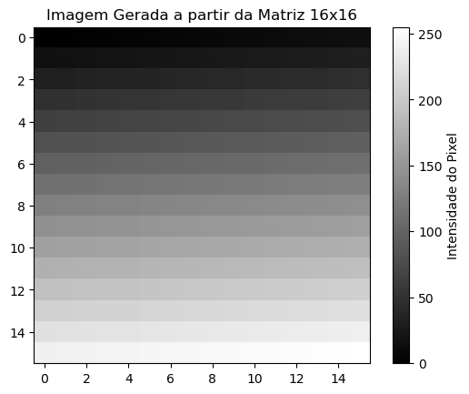
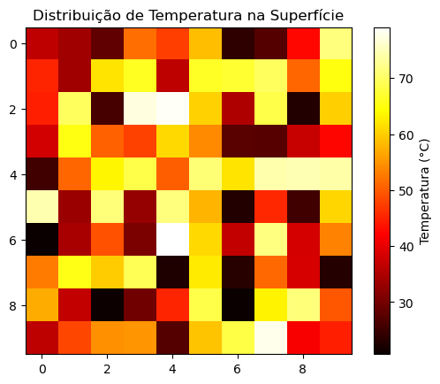

<center><h1>Aprendendo Matemática com Python</h1></center>
<center><h2>Curso de Extensão</h2></center>
<center><h3>Sidnei Furtado e Fernando Sasse e </h3></center>
<center><h3>CCT - UDESC</h3></center>
<center><h2>Introdução ao NumPy: Arrays</h2></center>

### 1. Introdução

Apresentaremos neste *notebook* uma introdução à biblioteca do Python chamado NumPy (Numerical Python, que é um pacote de código aberto amplamente utilizado em ciência e engenharia. NumPy é o principal pacote para computação científica em Python. Ele executa uma ampla variedade de operações matemáticas avançadas com alta eficiência. Veja a documentação completa do NumPy [aqui](https://numpy.org/doc/stable/index.html).

### 2. Importando a biblioteca Numpy

Antes de tudo devemos carregar a biblioteca na seção. Um modo de fazer isso é o seguinte:


```python
import numpy as np
```

Notemos no comando acima que o nome np é definido pelo usário. Ele será o prefixo a ser usado em todos os comandos da biblioteca NumPy. O nome np é convencionalmente utilizado.

### 3. Criando 1-arrays básicos

O elemento básico do Numpy é um objeto multidimensional chamado *array*. Por exemplo, criemos um array de ordem (*rank*). Um *array* 1-dimensional (1D ou 1-array) do Numpy pode ser criado da seguinte forma:


```python
a1 = np.array([1, 2, 3,4,5])
a1
```


    array([1, 2, 3, 4, 5])


Poderíamos também ter escrito:


```python
a1 = np.array([1, 2, 3,4,5])
print(a1)
```

    [1 2 3 4 5]


Verifiquemos o tipo de objeto:


```python
print(type(a1))
```

    <class 'numpy.ndarray'>


A princípio o 1-array parace similar a uma lista, que é o elemento mais básico do Python:


```python
A1 = [1,2,3,4,5]
print(A1)
type(A1)
```

    [1, 2, 3, 4, 5]


    list


No entanto, como veremos mais adiante, listas possuem diversas limitações para uso em cálculos numéricos. Podemos  criar um array a partir de uma lista:


```python
d = [1,2,3,4,5]
```


```python
arrd=np.array(d)
print(arrd)
type(arrd)
```

    [1 2 3 4 5]


    numpy.ndarray


Consideremos novamente o *1-array* a. Sua forma é


```python
print(a1.shape)
```

    (5,)


ou seje, ele tem 5 elementos ao longo de um eixo. O índices de um array começam em 0. Por exemplos, selecionemos uma dada componente


```python
a1[2] # terceira componente
```


    3


```python
a1[0] # primeira componente
```


    1


A indexação é cíclica. Por exemplo:


```python
a1[-1] #última componente
```


    5


### 4. Arrays n-dimensionais

Arrays podem ter um número arbitrário de dimensões e formas. Aqui está um exemplo array de 2 dimensões, de formato $4\times 3$:


```python
array_2d = np.array([[1, 2, 3], [4, 5, 6],[3 , 4, 5],[3,1,-2]])
x
```


    array([[ 1,  2,  3],
           [ 4,  5,  6],
           [ 3,  4,  5],
           [ 3,  1, -2]])


Podemos examinar a forma e a dimensão do array por meio dos chamados atributos:


```python
array_2d.shape
```


    (4, 3)


```python
array_2d.ndim
```


    2


As primeira dimensão é composta por pelas 4 listas $[ 1,  2,  3]$,  $[ 4,  5,  6]$, $[ 3,  4,  5]$, $[ 3,  1, -2]$. A segunda dimensão é composta pelos 3 elementos de cada lista. A dimensão é sempre igual ao número de componentes na expressão do formato. Os 2-arrays são de especial interesse em matemática, pois estão associados a matrizes, que trataremos em detalhe no próximo curso.

O exemplo a seguir é o de um array 3-dimensional de formato $4\times 2\times 5$:


```python
# Cria 4x2x5 3-array
array_3d = np.array([[[1, 2, 3, 5, 3],
                      [4, 5, 6, 2, 6]],

                      [[1, 2, 3, 5, 3],
                      [4, 5, 6, 2, 1]],

                      [[10, 11, 12, 23, 35],
                      [13, 14, 15, 31, 12]],

                      [[19, 20, 21, 25, 14],
                      [22, 23, 24, -43, 23]]])
```


```python
array_3d.shape
```


    (4, 2, 5)


```python
array_3d.ndim
```


    3


Nesse curso nos dedicaremos aos 1-arrays. É importante notar que


```python
A = np.array([1,2,3,4])
```

é um 1-array:


```python
print(A.ndim)
print(A.shape)
```

    1
    (4,)


Por outro lado,


```python
B = np.array([[1,2,3,4]])
```

é um 2-array de formato $1\times 4$:


```python
print(B.ndim)
print(B.shape)
```

    2
    (1, 4)


Esse fato será importante quando abordarmos matrizes e sistemas de equações (curso seguinte).

### 5. Eixos de arrays

Em NumPy, os **eixos (axes)** referem-se às dimensões de um array, ou seja, os "direcionamentos" ao longo dos quais os elementos do array estão organizados. Cada eixo representa uma direção ao longo da qual o array possui elementos, e esses eixos são numerados a partir de 0.

Um array 1D, ou vetor, tem apenas um eixo (eixo 0). 

Em um array 2D, como uma matriz, há dois eixos:
- **Eixo 0**: representa as linhas.
- **Eixo 1**: representa as colunas.

Por exemplo, 


```python
b = np.array([[1, 2, 3],
              [4, 5, 6]])
```

Aqui, o array `b` tem a forma `(2, 3)`:
- **Eixo 0**: contém 2 elementos (linhas).
- **Eixo 1**: contém 3 elementos (colunas).

Um array tridimensional pode ser visualizado como uma coleção de matrizes (ou camadas) e possui três eixos:
- **Eixo 0**: geralmente representa a profundidade ou as camadas do array.
- **Eixo 1**: representa as linhas.
- **Eixo 2**: representa as colunas.

Por exemplo, 


```python
c = np.array([[[1, 2, 3], 
               [4, 5, 6]],

              [[7, 8, 9], 
               [10, 11, 12]]])
```

O array `c` tem a forma `(2, 2, 3)`, onde:
- **Eixo 0**: contém 2 elementos (camadas).
- **Eixo 1**: contém 2 elementos (linhas por camada).
- **Eixo 2**: contém 3 elementos (colunas por linha).

Ao realizar operações, podemos especificar o eixo ao longo do qual desejamos que a operação aconteça. Por exemplo,


```python
np.sum(c, axis=0)  
```


    array([[ 8, 10, 12],
           [14, 16, 18]])


```python
np.sum(c, axis=1)  
```


    array([[ 5,  7,  9],
           [17, 19, 21]])


```python
np.sum(c, axis=2)
```


    array([[ 6, 15],
           [24, 33]])


### 6. Criando 1-arrays especiais
Podemos criar alguns 1-arrays especiais de forma rápida:


```python
a2 = np.zeros(6) # 1-array com zeros
a2
```


    array([0., 0., 0., 0., 0., 0.])


```python
a3 = np.ones(6) # 1-array com 1
a3
```


    array([1., 1., 1., 1., 1., 1.])


```python
a4 = np.random.random(6) # 1-array com elementos aleatórios,
                         #uniformemente distribuídos entre 0 e 1
a4
```


    array([0.45158276, 0.48962307, 0.08665156, 0.34898721, 0.46450142,
           0.68086336])


```python
a5 = np.random.randn(6) # 1-array com elementos aleatórios,
                        # normalmente distribuídos com média 0 e
                        # desvio padrão 1.
a5
```


    array([ 1.43585662,  0.57244615,  0.14691034,  0.20304244, -0.79117319,
            1.1112371 ])


### 7. Criando 1-arrays com regras de intervalo
Para definir um array num dado intervalo, com um número determinado de elementos igualmente espaçados. Suponhamos que queremos um array com 10 elementos igualmente espaçados no intervalo $[0,1]$:


```python
a6 = np.linspace(0,1, 10)
a6
```


    array([0.        , 0.11111111, 0.22222222, 0.33333333, 0.44444444,
           0.55555556, 0.66666667, 0.77777778, 0.88888889, 1.        ])


Notemos que se permitirmos 11 elementos, o intervalo será $0,1$:


```python
a6b = np.linspace(0,1, 11)
a6b
```


    array([0. , 0.1, 0.2, 0.3, 0.4, 0.5, 0.6, 0.7, 0.8, 0.9, 1. ])


Veremos mais adiante que o comando acima é útil para construir gráficos.

Suponhamos que queremos agora  criar um array com elementos, de 0 a 1, igualmente espaçados com intervalo 0.1:


```python
a7 = np.arange(0, 1.1, 0.1)
a7
```


    array([0. , 0.1, 0.2, 0.3, 0.4, 0.5, 0.6, 0.7, 0.8, 0.9, 1. ])


Criemos um array de 10 a 0, ordenado de forma decrescente,com passo -1:


```python
np.arange(10, -1, -1)
```


    array([10,  9,  8,  7,  6,  5,  4,  3,  2,  1,  0])


Nos exemplos acima notamos que o último elemento em arange não é incluído.

### 8.  Indexação e fatiamento de arrays 1D

Vejamos em maior detalhe a manipulação de índices de arrays 1-dimensionais. Seja o array:


```python
a=np.array([3,4,2,1,7,9])
```

O primeiro índice do *array* é 0. Por exemplo,


```python
print(a[0])
print(a[1])
```

    3
    4


No entanto, em alguns problemas é útil especificar componentes por índices negativos. Vejamos alguns exemplos para entender como funcionam:


```python
a[-1] #último elemento do array
```


    9


```python
a[-2]
```


    7


```python
a[-3]
```


    1


```python
a[-5] #primeiro elemento
```


    4


Suponhamos que queremos listar os elementos de um dado array de *N*-dimensional do elemento *n* até o elemento *m*. Por exemplo se queremos as três primeiras componentes de *a* , começando da segunda componente, procedemos do seguinte modo:


```python
print(a[1:4]) #itens de a[n,m] começam em n e vão até m-1:
```

    [4 2 1]


Usando índices negativos:


```python
print(a[-4:-1])
```

    [2 1 7]


Se quisermos selecionar as 3 primeiras componentes com incrementos de duas unidades:


```python
print(a[0:6:2])
```

    [3 2 7]


Algumas técnicas úteis, similares ao Matlab:


```python
a[2:] #componentes de a[m:] começam em m e vão até o final.
```


    array([2, 1, 7, 9])


```python
a
```


    array([3, 4, 2, 1, 7, 9])


```python
a[:-2] # do primeiro elemento até o elemento anterior a a[-2]
```


    array([3, 4, 2, 1])


```python
a[:4] #componentes de a[:m] começam em 0 e vão até m-1.
```


    array([3, 4, 2, 1])


```python
a[:] #array completo
```


    array([3, 4, 2, 1, 7, 9])


Podemos concatenar *1-arrays* da seguinte forma:


```python
x = np.array([1,2,3,4,5])
y = np.array([-1, -2, -3])
```


```python
np.concatenate([x,y])
```


    array([ 1,  2,  3,  4,  5, -1, -2, -3])


### 8. Operações matemáticas com  arrays 1D

Podemos realizar operações matemáticas sobre 1-arrays, elemento por elemento:


```python
c = np.array([3,5,2,1,4])
2*c # Cada elemento é multiplicado por 2
```


    array([ 6, 10,  4,  2,  8])


```python
1/c # Calcula o inverso de cada elemento
```


    array([0.33333333, 0.2       , 0.5       , 1.        , 0.25      ])


As operações básicas de 1-arrays de mesma dimensão sãp feitas elemento a elemento por default:


```python
a = np.array([1,2,3,4,5])
b = np.array([6,-4,5,4,1])
a+b
```


    array([ 7, -2,  8,  8,  6])


```python
a/b # divisão elemento a elemento
```


    array([ 0.16666667, -0.5       ,  0.6       ,  1.        ,  5.        ])


```python
a*b # multiplicação elemento a elemento
```


    array([ 6, -8, 15, 16,  5])


```python
 a**2 # cada elemento é elevado ao quadrado
```


    array([ 1,  4,  9, 16, 25])


```python
np.sqrt(a) # raiz quadrada de cada elemento
```


    array([1.        , 1.41421356, 1.73205081, 2.        , 2.23606798])


```python
np.tan(a) # tangente de cada componente
```


    array([ 1.55740772, -2.18503986, -0.14254654,  1.15782128, -3.38051501])


O produto interno de dois vetores pode ser feito do seguinte modo:


```python
x = np.array([1,2,3])
y = np.array([-1,3,2])
```


```python
x.dot(y)
```


    11


De forma equivalente,


```python
np.dot(x,y)
```


    11


```python
np.vdot(x,y)
```


    11


O produto vetorial (válido somente para 1-arrays de 3 componentes) pode ser obtido da seguinte forma:


```python
np.cross(x,y)
```


    array([-5, -5,  5])


Algumas outras operações:  


```python
print(np.sum(x))  #Soma todos os elementos do array
```

    6


```python
np.mean(x) #Calcula a média
```


    2.0


```python
np.std(x) #Calcula o devio padrão
```


    0.816496580927726


```python
np.median(x) #Mediana
```


    2.0


```python
print(np.correlate(x,y)) #Coeficiente de correlação
```

    [11]


```python
print(np.cov(x,y)) #Matriz de covariância
```

    [[1.         1.5       ]
     [1.5        4.33333333]]


```python
np.percentile(a1,90) #90% dos elementos desse array estão abaixo desse número
```


    4.6


```python
A = np.array([2,6,3,6,1,2,4,7]) # Ordena em ordem crescente
np.sort(A)
```


    array([1, 2, 2, 3, 4, 6, 6, 7])


```python
np.sort(A)[::-1] # Ordena em ordem decrescente
```


    array([7, 6, 6, 4, 3, 2, 2, 1])


Números complexos podem ser representados na forma.


```python
z=2+3j
```

A operação de conjugação complexa é definida por


```python
np.conj(2+3j)
```


    (2-3j)


Façamos o produto escalar de dois 1-arrays complexos $z_1\cdot z_2 = (z_1)^{\dagger} z_2$, sendo que o símbolo $\dagger$ denota conjugação hermitiana:


```python
z1 = np.array([1+2j,1-1j,1+3j])
z2 = np.array([2-2j,1+1j,4-2j])
```


```python
np.conj(z1).dot(z2)
```


    (-4-18j)


### 10.   Arrays 1D booleanos

Podemos criar um array booleano estabelecendo uma condição sobre cada elemento do array 1D numérico:


```python
import numpy as np
```


```python
a = np.array([5,3,4,2,7,2,9,5,6,1])
a > 4
```


    array([ True, False, False, False,  True, False,  True,  True,  True,
           False])


Podemos usar o array booleano para fazer seleção de elementos. Por exemplo,


```python
a[a>4] # seleciona todos os elementos que são maiores que 4
```


    array([5, 7, 9, 5, 6])


```python
# condição maior que 2 ou maior que 3:
(a<2) | (a>3)
```


    array([ True, False,  True, False,  True, False,  True,  True,  True,
            True])


```python
a[(a<2) | (a>3)] #seleciona elementos menores que 2 ou maiores que 3
```


    array([5, 4, 7, 9, 5, 6, 1])


```python
# condição menor que 5 e maior que 2:
(a<5) & (a>2)
```


    array([False,  True,  True, False, False, False, False, False, False,
           False])


```python
a[(a<5) & (a>2)] # seleciona elementos menores que 5 e maiores que 2:
```


    array([3, 4])


Podemos comparar dois arrays, componente a componente:


```python
a1 = np.array([2,3,4,6,2,4])
a2 = np.array([4,3,5,3,2,1])
```


```python
a1[a1<a2] # seleciona elementos de a1 menores que os de a2, respeitando a ordem
```


    array([2, 4])


Similarmente para a2:


```python
a2[a1<a2]
```


    array([4, 5])


Por exemplo, obtenhamos os elementos de um array que são divisíveis por 4:


```python
a=np.array([4,5,8,24,22,58,36,90,92,94,96])
a_div4 = a[a%4==0]
a_div4
```


    array([ 4,  8, 24, 36, 92, 96])


Procedimentos relativamente complicados por ser implementados facilmente com Numpy. Por exemplo, Somemos os números inteiros de 0 a 10000, exceto aqueles que podem ser divididos por 4 e 7.

Inicialmente geramos o array de todos os inteiros de 0 a 10000:


```python
L = np.arange(0,10001,1) #lista os inteiros de 0 a 10000
L
```


    array([    0,     1,     2, ...,  9998,  9999, 10000])


Formamos duas listas:


```python
L1 = L%4 !=0 #lista booleana dos elementos que não são divisíveis por 4
L1
```


    array([False,  True,  True, ...,  True,  True, False])


```python
L2 = L%7 !=0 #lista booleana dos elementos que não são divisíveis por 7
L2
```


    array([False,  True,  True, ...,  True,  True,  True])


Notemos que as variáveis lógicas *True* e *False* satisfazem as regras lógicas para *AND*. Por exemplo,


```python
A1 = np.array([True, False, False, True, False])
A2 = np.array([False, False, True, True, True])
```


```python
A1*A2 #AND
```


    array([False, False, False,  True, False])


```python
A1+A2 #AND
```


    array([ True, False,  True,  True,  True])


Podemos aplicar esse resultado ao nosso problema:


```python
L1*L2 # não são divisíveis por 4 e 7
```


    array([False,  True,  True, ...,  True,  True, False])


Os números que não são divisíveis por 4 e 7 são, portanto, dados por


```python
L[L1*L2]
```


    array([   1,    2,    3, ..., 9997, 9998, 9999])


Examinemos alguns elementos:


```python
L[L1*L2][:30]
```


    array([ 1,  2,  3,  5,  6,  9, 10, 11, 13, 15, 17, 18, 19, 22, 23, 25, 26,
           27, 29, 30, 31, 33, 34, 37, 38, 39, 41, 43, 45, 46])


Podemos agora somar os elementos:


```python
sum(L[L1*L2])
```


    32147142


Vejamos um exemplo usando arrays com strings. Consideremos o problema de selecionar, numa lista de nomes, aqueles que começam com a letra J. Para isso criamos uma função lambda que seleciona o primeiro elemento de um string ou de de um 1-array:


```python
f = lambda g: g[0]
```

Por exemplo,


```python
f('casa') # primeiro caractere de um string
```


    'c'


```python
f([2,3,4]) # primeiro elemento de uma lista
```


    2


```python
f(np.array([2,3,4,9])) # primeiro elemento de um 1-array
```


    2


```python
f(np.array(['Ana', 'Carlos'])) # primeiro elemento de um 1-array de strings
```


    'Ana'


Tomemos um array de nomes:


```python
nomes = np.array(['Pedro', 'Joao', 'Jose', 'Luis', 'Maria', 'Cleopatra', 'Theorora', 'Elisa'])
```

Apliquemos a função `f` a cada elemento do 1-array `nomes`:


```python
primeira_letra = np.vectorize(f)(nomes)
primeira_letra
```


    array(['P', 'J', 'J', 'L', 'M', 'C', 'T', 'E'], dtype='<U1')


Geramos o array booleano que verifica se a primeira letra do array `nomes` é J:


```python
primeira_letra_J = primeira_letra=='J'
primeira_letra_J
```


    array([False,  True,  True, False, False, False, False, False])


Podemos agora usar esse array booleano para obter os nomes que começam com J:


```python
nomes[primeira_letra_J]
```


    array(['Joao', 'Jose'], dtype='<U9')


Vejamos mais um exemplo. Seja a lista de nomes: Achlys, Aether, Aion, Ananke, Chaos, Chronos, Erebus, Eros, Gaia, Hemera, Nesoi, Nyx, Ourea, Phanes, Pontus, Tartarus, Thalassa, Uranus, Aia.  Determine os nomes que começam ou terminam com A.

Criamos o array com nomes:


```python
Nomes = np.array(["Achlys", "Aether", "Aion", "Ananke", "Chaos", "Chronos", "Erebus",
         "Eros", "Gaia", "Hemera", "Nesoi", "Nyx", "Ourea", "Phanes", "Pontus",
         "Tartarus", "Thalassa", "Uranus", "Aia"])
```


```python
f = lambda g: g[0]
```


```python
h = lambda g: g[-1]
```

Formamos um 1-array com a primeira letra de cada nome e outro com a última letra:


```python
primeira_letra = np.vectorize(f)(Nomes)
primeira_letra
```


    array(['A', 'A', 'A', 'A', 'C', 'C', 'E', 'E', 'G', 'H', 'N', 'N', 'O',
           'P', 'P', 'T', 'T', 'U', 'A'], dtype='<U1')


```python
ultima_letra = np.vectorize(h)(Nomes)
ultima_letra
```


    array(['s', 'r', 'n', 'e', 's', 's', 's', 's', 'a', 'a', 'i', 'x', 'a',
           's', 's', 's', 'a', 's', 'a'], dtype='<U1')


Definimos o 1-array booleano que verifica, respectivamente, se cada elemento de *primeira_letra* é ou não igual a "A":


```python
primeira_letra_A = primeira_letra=='A'
primeira_letra_A
```


    array([ True,  True,  True,  True, False, False, False, False, False,
           False, False, False, False, False, False, False, False, False,
            True])


Similarmente para *ultima_letra*:


```python
ultima_letra_a = ultima_letra =='a'
ultima_letra_a
```


    array([False, False, False, False, False, False, False, False,  True,
            True, False, False,  True, False, False, False,  True, False,
            True])


O seguinte 1-array determina se ao menos um elemento do par ordenado dos 1-arrays *primeira_letra_A* e *ultima_letra_a* é igual a *True*:


```python
A_ou_a = primeira_letra_A + ultima_letra_a
A_ou_a
```


    array([ True,  True,  True,  True, False, False, False, False,  True,
            True, False, False,  True, False, False, False,  True, False,
            True])


Para encontrar os nomes, basta agora usar esse 1-array booleano como índice de *Nomes*:


```python
Nomes[A_ou_a]
```


    array(['Achlys', 'Aether', 'Aion', 'Ananke', 'Gaia', 'Hemera', 'Ourea',
           'Thalassa', 'Aia'], dtype='<U8')


### 11. Regras adicionais para manipulação de arrays

#### 11.1 np.reshape

A função `numpy.reshape` é uma ferramenta do NumPy que permite alterar a forma de um array existente sem modificar seus dados. Essa função é útil quando você precisa reorganizar os dados para diversos fins, como torná-los compatíveis com outros arrays para cálculos, melhorar a legibilidade ou prepará-los para um tipo específico de processamento.

Por exemplo, suponha que você tenha um 1-array com 6 elementos e queira redimensioná-lo para um 2-array com 2 linhas e 3 colunas:


```python
import numpy as np
```


```python
# Array 1D original
a = np.array([1, 2, 3, 4, 5, 6])

# Redimensiona para um array 2x3
A = np.reshape(a, (2, 3))
```


```python
print("Array Original:\n", a)
print("Array Redimensionado (2x3):\n", A)
```

    Array Original:
     [1 2 3 4 5 6]
    Array Redimensionado (2x3):
     [[1 2 3]
     [4 5 6]]


Podemos permitir que o NumPy determine automaticamente uma dimensão especificando -1. Aqui, vamos converter o array em 3 linhas, permitindo que o NumPy descubra o número de colunas:


```python
# Array 1D original
array_1d = np.array([1, 2, 3, 4, 5, 6, 7, 8])

# Redimensiona para um array 3x2 usando -1
array_2d = np.reshape(array_1d, (4, -1))

print("Array Redimensionado (4x2):\n", array_2d)
```

    Array Redimensionado (4x2):
     [[1 2]
     [3 4]
     [5 6]
     [7 8]]


O redimensionamento é especialmente útil ao trabalhar com dados multidimensionais, como imagens ou lotes de dados. Por exemplo, vamos pegar um array com a forma (2, 3, 4) e redimensioná-lo para (4, 3, 2):


```python
# Array 3D original
array_3d = np.arange(24).reshape(2, 3, 4)

# Redimensiona para uma forma 3D diferente
array_redimensionado = np.reshape(array_3d, (4, 3, 2))
```


```python
print("Array Original (2x3x4):\n", array_3d)
print("Array Redimensionado (4x3x2):\n", array_redimensionado)
```

    Array Original (2x3x4):
     [[[ 0  1  2  3]
      [ 4  5  6  7]
      [ 8  9 10 11]]
    
     [[12 13 14 15]
      [16 17 18 19]
      [20 21 22 23]]]
    Array Redimensionado (4x3x2):
     [[[ 0  1]
      [ 2  3]
      [ 4  5]]
    
     [[ 6  7]
      [ 8  9]
      [10 11]]
    
     [[12 13]
      [14 15]
      [16 17]]
    
     [[18 19]
      [20 21]
      [22 23]]]


 Podemos usar reshape para achatar um array em uma única dimensão. Isso é útil quando você precisa realizar operações que requerem um vetor 1D:


```python
# Array 2D original
array_2d = np.array([[1, 2, 3], [4, 5, 6], [3,4,5]])
array_2d
```


    array([[1, 2, 3],
           [4, 5, 6],
           [3, 4, 5]])


```python
# Achata o array para 1D
array_achatado = np.reshape(array_2d, -1)
array_achatado
```


    array([1, 2, 3, 4, 5, 6, 3, 4, 5])


**Exemplo.**  Organizando Dados Meteorológicos. Suponhamos que temos um 1-array que contém as temperaturas médias registradas em uma cidade durante 12 meses, mas cada mês tem 3 valores correspondentes à temperatura média no início, no meio e no final do mês, como mostrado abaixo:


```python
import numpy as np
# Array 1D com as temperaturas médias para 12 meses, cada mês tem 3 valores
temperaturas = np.array([22, 24, 23, 18, 19, 20, 15, 16, 15,
                         21, 20, 22, 25, 24, 26, 27, 28, 26,
                         30, 29, 31, 34, 32, 33, 35, 36, 34,
                         28, 27, 26, 24, 23, 22, 21, 22, 23])
```

Converta esse 1-array em uma matriz (2-array), onde cada linha representa um mês e cada coluna corresponde a um período específico do mês e calcule a média de temperatura para cada mês e exiba uma lista das médias mensais.


```python
# Redimensionamos o array `temperaturas` para uma matriz 12x3
temperaturas_mensais = np.reshape(temperaturas, (12, 3))
temperaturas_mensais
```


    array([[22, 24, 23],
           [18, 19, 20],
           [15, 16, 15],
           [21, 20, 22],
           [25, 24, 26],
           [27, 28, 26],
           [30, 29, 31],
           [34, 32, 33],
           [35, 36, 34],
           [28, 27, 26],
           [24, 23, 22],
           [21, 22, 23]])


```python
# Calculamos a média de temperatura para cada mês
media_mensal = np.mean(temperaturas_mensais, axis=1)
media_mensal
```


    array([23.        , 19.        , 15.33333333, 21.        , 25.        ,
           27.        , 30.        , 33.        , 35.        , 27.        ,
           23.        , 22.        ])


**Exemplo.** Transformando uma Imagem em Tons de Cinza. Suponhamos que temos uma imagem em tons de cinza representada por um array 1D com 256 valores de pixel (por exemplo, uma imagem 16x16). Converta esse 1-array em uma matriz  que represente a imagem.


```python
# Geração de valores de pixel fictícios para uma imagem 16x16 em tons de cinza
imagem_pixels = np.arange(256)
```


```python
# Redimensionando o array `imagem_pixels` para uma matriz 16x16
imagem_matriz = np.reshape(imagem_pixels, (16, 16))

print("Imagem em tons de cinza (16x16):\n", imagem_matriz)
```

    Imagem em tons de cinza (16x16):
     [[  0   1   2   3   4   5   6   7   8   9  10  11  12  13  14  15]
     [ 16  17  18  19  20  21  22  23  24  25  26  27  28  29  30  31]
     [ 32  33  34  35  36  37  38  39  40  41  42  43  44  45  46  47]
     [ 48  49  50  51  52  53  54  55  56  57  58  59  60  61  62  63]
     [ 64  65  66  67  68  69  70  71  72  73  74  75  76  77  78  79]
     [ 80  81  82  83  84  85  86  87  88  89  90  91  92  93  94  95]
     [ 96  97  98  99 100 101 102 103 104 105 106 107 108 109 110 111]
     [112 113 114 115 116 117 118 119 120 121 122 123 124 125 126 127]
     [128 129 130 131 132 133 134 135 136 137 138 139 140 141 142 143]
     [144 145 146 147 148 149 150 151 152 153 154 155 156 157 158 159]
     [160 161 162 163 164 165 166 167 168 169 170 171 172 173 174 175]
     [176 177 178 179 180 181 182 183 184 185 186 187 188 189 190 191]
     [192 193 194 195 196 197 198 199 200 201 202 203 204 205 206 207]
     [208 209 210 211 212 213 214 215 216 217 218 219 220 221 222 223]
     [224 225 226 227 228 229 230 231 232 233 234 235 236 237 238 239]
     [240 241 242 243 244 245 246 247 248 249 250 251 252 253 254 255]]


Podemos ver a imagem com com matplotlib: 


```python
import matplotlib.pyplot as plt
```


```python
# Exibindo a imagem com matplotlib
plt.imshow(imagem_matriz, cmap='gray', interpolation='nearest')
plt.colorbar(label='Intensidade do Pixel')
plt.title("Imagem Gerada a partir da Matriz 16x16")
plt.show()
```


    

    


**Exemplo.** Vamos considerar um exemplo da física experimental que envolva o uso de matrizes para representar dados coletados em uma malha de sensores. Imagine um experimento em que uma superfície é coberta com sensores de temperatura dispostos em uma grade de 10x10, e a cada sensor mede a temperatura em um ponto específico. A partir dos dados coletados, deseja-se gerar uma imagem para visualizar a distribuição de temperatura na superfície. Suponhamos que a leitura dos valores é feita da esquerda para direita, de cima para baixo. 

- Organizar esses dados em uma matriz 10x10.
- Gerar uma imagem que mostre a distribuição de temperatura na superfície.
- Identificar a temperatura média da superfície.


```python
import numpy as np
import matplotlib.pyplot as plt
```

Vamos gerar os valores de temperatura fictícios de forma aleatória usando `np.random.uniform()`
 para simular leituras de sensores entre 20 e 80 °C.


```python
# Dados fictícios de temperatura coletados por 100 sensores (10x10)
temperaturas = np.random.uniform(low=20, high=80, size=100) 
temperaturas
```


    array([36.58178916, 33.71394855, 28.29560107, 51.62878889, 47.57538842,
           58.68232535, 24.10139908, 27.29749806, 42.71962004, 71.51056871,
           45.1596236 , 33.72330708, 61.87787803, 66.19319914, 36.33065978,
           66.52839365, 67.05987424, 69.55245228, 50.8700897 , 64.96591929,
           44.72585299, 69.59365724, 26.15866635, 77.11497228, 78.64412889,
           60.25425901, 35.10360463, 68.45273582, 22.84938384, 60.03786043,
           38.17663181, 65.35191527, 50.45963327, 47.64373766, 60.91480049,
           54.09949702, 27.65754555, 27.43259276, 37.2204464 , 42.5835865 ,
           25.61022535, 51.03550665, 63.56152389, 68.42219257, 50.33038724,
           71.11420742, 61.97695557, 74.26588315, 74.75954091, 74.01750329,
           74.515218  , 33.46870418, 71.16051916, 32.90574386, 71.57294424,
           57.84654592, 22.95737029, 45.447772  , 25.51547782, 60.84688313,
           20.70188683, 34.53760539, 49.13986927, 30.52619509, 79.11053295,
           61.06219744, 36.90076096, 71.65972064, 38.40474706, 53.47619628,
           52.79496769, 65.43609344, 59.91397367, 69.15830789, 22.59301506,
           62.55514843, 23.413308  , 51.09292557, 38.61179064, 23.0797197 ,
           57.13721766, 36.78598277, 20.93241039, 29.80655378, 45.16367055,
           68.39796035, 20.85068247, 63.1665646 , 71.34917489, 49.59539615,
           36.22629482, 48.18872059, 54.55065313, 55.08794597, 27.23467593,
           59.25174582, 68.22508066, 77.807561  , 41.55790126, 44.67176823])


A temperatura média é dada por:


```python
temp_media = np.mean(temperaturas)
round(temp_media,2)
```


    50.1


Transformamos esse array em uma matriz 10 x 10: 


```python
temperatura_matriz = temperaturas.reshape(10, 10)
temperatura_matriz
```


    array([[36.58178916, 33.71394855, 28.29560107, 51.62878889, 47.57538842,
            58.68232535, 24.10139908, 27.29749806, 42.71962004, 71.51056871],
           [45.1596236 , 33.72330708, 61.87787803, 66.19319914, 36.33065978,
            66.52839365, 67.05987424, 69.55245228, 50.8700897 , 64.96591929],
           [44.72585299, 69.59365724, 26.15866635, 77.11497228, 78.64412889,
            60.25425901, 35.10360463, 68.45273582, 22.84938384, 60.03786043],
           [38.17663181, 65.35191527, 50.45963327, 47.64373766, 60.91480049,
            54.09949702, 27.65754555, 27.43259276, 37.2204464 , 42.5835865 ],
           [25.61022535, 51.03550665, 63.56152389, 68.42219257, 50.33038724,
            71.11420742, 61.97695557, 74.26588315, 74.75954091, 74.01750329],
           [74.515218  , 33.46870418, 71.16051916, 32.90574386, 71.57294424,
            57.84654592, 22.95737029, 45.447772  , 25.51547782, 60.84688313],
           [20.70188683, 34.53760539, 49.13986927, 30.52619509, 79.11053295,
            61.06219744, 36.90076096, 71.65972064, 38.40474706, 53.47619628],
           [52.79496769, 65.43609344, 59.91397367, 69.15830789, 22.59301506,
            62.55514843, 23.413308  , 51.09292557, 38.61179064, 23.0797197 ],
           [57.13721766, 36.78598277, 20.93241039, 29.80655378, 45.16367055,
            68.39796035, 20.85068247, 63.1665646 , 71.34917489, 49.59539615],
           [36.22629482, 48.18872059, 54.55065313, 55.08794597, 27.23467593,
            59.25174582, 68.22508066, 77.807561  , 41.55790126, 44.67176823]])


Podemos gerar uma mapa de cor para a temperatura:


```python
# Gerando uma imagem da distribuição de temperatura
plt.imshow(temperatura_matriz, cmap='hot', interpolation='nearest')
plt.colorbar(label='Temperatura (°C)')
plt.title("Distribuição de Temperatura na Superfície")
plt.show()
```


    

    


#### 11.2 np.stack

A função `np.stack`  é usada para juntar (ou empilhar) arrays ao longo de um novo eixo. Por exemplo, para empilhar os 1-arrays ao longo de linhas procedemos da seguinte forma:


```python
import numpy as np

a = np.array([1, 2, 3])
b = np.array([4, 5, 6])
c = np.array([7, 8, 9])

np.stack((a, b, c), axis=0)
```


    array([[1, 2, 3],
           [4, 5, 6],
           [7, 8, 9]])


Por outro lado, podemos empilhar os 1-arrays ao longo de colunas (axis = 1):


```python
np.stack((a, b, c), axis=1)
```


    array([[1, 4, 7],
           [2, 5, 8],
           [3, 6, 9]])


Podemos empilhar matrizes (por exemplo, cada matriz poderia representar uma imagem), para formar um 3-array:


```python
# Simulando três imagens em escala de cinza de 32x32 pixels
imagem1 = np.random.rand(32, 32)
imagem2 = np.random.rand(32, 32)
imagem3 = np.random.rand(32, 32)
```


```python
# Empilhando as imagens para criar um array 3D
imagens_stack = np.stack((imagem1, imagem2, imagem3), axis=0)
```

Vejamos a forma do resultado:


```python
imagens_stack.shape
```


    (3, 32, 32)


Agora, images_stack é um 3-array com a forma (3, 32, 32), onde cada "plano" ao longo do eixo 0 representa uma imagem. Isso facilita o processamento, pois podemos aplicar operações em todas as imagens ao mesmo tempo, como filtragem, normalização, etc.

#### 11.3 np.hstack

A função `np.hstack` é usada para empilhar (ou concatenar) arrays horizontalmente, ou seja, ao longo do eixo das colunas. Diferente da função stack, que cria uma nova dimensão ao longo do eixo especificado, a função hstack realiza a concatenação dos arrays de forma que as colunas são unidas lado a lado. Por exemplo, 


```python
import numpy as np

a = np.array([1, 2, 3])
b = np.array([4, 5, 6])
np.hstack((a, b))
```


    array([1, 2, 3, 4, 5, 6])


Quando lidamos com 2-arrays, `hstack` concatena os arrays ao longo do eixo das colunas:


```python
a = np.array([[1, 2], [3, 4]])
b = np.array([[5, 6], [7, 8]])

np.hstack((a, b))
```


    array([[1, 2, 5, 6],
           [3, 4, 7, 8]])


Todos os arrays devem ter o mesmo número de linhas para que hstack funcione corretamente.

#### 11.4 np.vstack

A função `np.vstack` do NumPy é usada para empilhar arrays verticalmente, ou seja, ao longo do eixo das linhas. Isso significa que a função concatena arrays colocando-os um abaixo do outro. Diferente da função hstack, que combina arrays horizontalmente (lado a lado), vstack organiza os arrays de forma que novas linhas são adicionadas ao final. A função é útil para combinar arrays que têm o mesmo número de colunas.

Podemos usar essa função para concatenar dois 1-arrays em uma matriz:


```python
import numpy as np

a = np.array([1, 2, 3])
b = np.array([4, 5, 6])

np.vstack((a, b))
```


    array([[1, 2, 3],
           [4, 5, 6]])


Podemos empilhar verticalmente duas matrizes:


```python
a = np.array([[1, 2], [3, 4]])
b = np.array([[5, 6], [7, 8]])

np.vstack((a, b))
```


    array([[1, 2],
           [3, 4],
           [5, 6],
           [7, 8]])


**Exemplo.** Agregando Dados de Vários Experimentos. 
Suponha que temos dados de vários experimentos realizados separadamente, mas com as mesmas variáveis medidas. Podemos usar vstack para combinar esses dados em um único array, facilitando a análise conjunta:


```python
# Dados do experimento 1
experimento1 = np.array([[1.1, 2.2, 3.3]])
# Dados do experimento 2
experimento2 = np.array([[4.4, 5.5, 6.6]])
# Dados do experimento 3
experimento3 = np.array([[7.7, 8.8, 9.9]])

# Combinando os dados dos experimentos
dados = np.vstack((experimento1, experimento2, experimento3))
dados
```


    array([[1.1, 2.2, 3.3],
           [4.4, 5.5, 6.6],
           [7.7, 8.8, 9.9]])


#### 11.5 np.where

A função `np.where` é útil para realizar operações condicionais em arrays de forma eficiente. Ela permite selecionar índices de elementos, ou os próprios elementos de um array com base em uma condição booleana. Por exemplo, 


```python
import numpy as np
```


```python
A = np.array([10, 20, 30, 40, 50])
indices = np.where(A > 25)
indices
```


    (array([2, 3, 4]),)


Para selecionar diretamente os elementos que satisfazem a condição: 


```python
A[np.where(A > 25)]
```


    array([30, 40, 50])


Podemos substituir valores de um array dependendo de uma condição:


```python
A = np.array([10, 20, 30, 40, 50])
A1 = np.where(A > 25, 1, 0)
A1
```


    array([0, 0, 1, 1, 1])


Aqui, a função substitui os valores por 1 onde a condição `arr > 25` é verdadeira e por 0 onde é falsa.

Podemos combinar np.where com operações lógicas para definir condições mais complexas:


```python
A = np.array([10, 20, 30, 40, 50])
A1 = np.where((A > 15) & (A < 45), A, 0)
A1
```


    array([ 0, 20, 30, 40,  0])


Nesse exemplo, o `np.where` substitui os valores que estão entre 15 e 45 pelo próprio valor, enquanto os demais valores são substituídos por 0.

**Exemplo.**  Uma das técnicas mais comuns para tratar valores NaN em um array 1D é substituir os NaN pela média ou mediana de todos os valores não NaN no array. Essa abordagem é útil quando se deseja manter a média geral dos dados estável:


```python
A = np.array([7.5, np.nan, 2.5, 1.0, 3.0, 3.2, np.nan])
A
```


    array([7.5, nan, 2.5, 1. , 3. , 3.2, nan])


```python
mean_A = np.nanmean(A) # calcula a média sem levar em conta NaN
A1 = np.where(np.isnan(A), mean_A, A)
A1
```


    array([7.5 , 3.44, 2.5 , 1.  , 3.  , 3.2 , 3.44])


No exemplo acima usamos `np.nanmean`, que calcula a média do array 1D sem levar em conta os elementos NaN. Se a mediana for preferível (menos afetada por valores extremos), podemos usar `np.nanmedian`:


```python
median_A = np.nanmedian(A)
A2 = np.where(np.isnan(A), median_A, A)
A2
```


    array([7.5, 3. , 2.5, 1. , 3. , 3.2, 3. ])


Se queremos substituir `NaN` por um valor fixo: 


```python
A3 = np.where(np.isnan(A), 0, A)
A3
```


    array([7.5, 0. , 2.5, 1. , 3. , 3.2, 0. ])


A técnica chamada de *forward fill* (preencher com o valor anterior) ou *backward fill* (preencher com o valor seguinte) é comumente usada em séries temporais, onde a continuidade entre os dados adjacentes é importante:


```python
# Forward fill usando np.where com um loop
A = np.array([7.5, np.nan, 2.5, 1.0, 3.0, 3.2, np.nan])
for i in range(1, len(A)):
    A[i] = np.where(np.isnan(A[i]), A[i - 1], A[i])
A
```


    array([7.5, 7.5, 2.5, 1. , 3. , 3.2, 3.2])


Note que este loop não é eficiente para arrays 1D muito longos. Em tal caso, é preferível uma forma vetorizada, que envolve funções que não estudamos aqui. 

### 12. Exercícios

1. Crie um array usando a função `np.arange` que contenha todos os números inteiros de 0 a 20.

2. Crie um array com 15 números igualmente espaçados entre 0 e 1 (inclusive) usando `np.linspace`.

3. Dado o array `arr = np.arange(10)`, obtenha um subarray que contenha os três primeiros elementos de `arr`.

4. Utilize o array do exercício anterior e obtenha um novo array que contenha apenas os elementos ímpares.

5. Dado um array qualquer (por exemplo de 10 componentes) no qual as componentes são ângulos em radianos, determine o correspondente array com ângulos dados em graus.

6. Dado o array `a = np.array([1, 2, 3, 4, 5])`, crie um array booleano que identifique quais elementos de `a` são maiores que 3.

7. Utilizando o array `A = np.array([10, 22, 33, 44, 55, 66, 77, 88, 99]`, crie um array booleano que identifique os elementos maiores que 15 e menores que 120. Use este array booleano para filtrar os elementos correspondentes do array A.

8. Dado o array `B = np.array([3, 6, 9, 12, 15, 18, 21, 24, 27, 30]`, crie um array booleano para selecionar apenas os elementos que são múltiplos de 5.

9. Utilize o array do exercício anterior e obtenha um novo array que contenha apenas os elementos ímpares.

10. Crie dois arrays, um com números pares de 2 a 20 e outro com números ímpares de 1 a 19. Concatene-os em um único array ordenado.

11. Crie dois arrays `a = np.arange(5)` e `b = np.arange(5, 10)`. Calcule a soma elemento a elemento desses dois arrays na forma $\sqrt{a^2+b^2}$.

12. Crie dois arrays, `a = np.array([1, 2, 3])` e `b = np.array([4, 5, 6])`. Concatene-os em um único array.

13. Usando arrays booleanos determine todos o inteiros menores que 200 que são divisíveis por 2 e 3.

14. Crie uma lista com 20 nomes de pessoas (só primeiro nome). Usando arrays booleanos determine os nomes que começam com uma vogal e terminam com a letra "e".

15. Crie um array 1D com números de 1 a 12. Em seguida, use `np.reshape` para reorganizá-lo em um array 2D com 3 linhas e 4 colunas. Finalmente, altere o formato para ter 4 linhas e 3 colunas.

16.  Crie dois arrays 1D, cada um com 5 elementos à sua escolha. Use `np.stack` para empilhá-los de forma a obter um array 2D (ou seja, uma matriz) com duas linhas e cinco colunas. Em seguida, use `np.stack` novamente para obter um array 3D.

17. Crie dois arrays 2D, ambos com 2 linhas e 3 colunas, contendo números inteiros à sua escolha. Use `np.vstack` para empilhar esses dois arrays verticalmente e formar um novo array com 4 linhas e 3 colunas.

18. Crie três arrays 1D com 4 elementos cada. Use `np.hstack` para combiná-los horizontalmente em um único array 2D com 4 linhas e 3 colunas.

19. Considere um array 1D com 10 elementos, contendo números inteiros entre 1 e 20. Use `np.where` para substituir todos os valores maiores que 10 por 10 e todos os valores menores ou iguais a 10 por 0.

20. Temos uma lista de medidas horárias de temperatura coletadas ao longo de uma semana.


```python
temperaturas = np.array([23.2, 25.7, 24.0, np.nan, 21.4, np.nan, 21.6, 28.4, 29.5, 20.8, 26.9,
        np.nan, 23.5, 28.9, 16.1, 16.3, 15.3, 27.5, 26.7, 28.1, 29.7, 27.0,
       21.9, 26.7, 16.8, 24.6, 17.2, 29.2, 22.8, 21.2, np.nan, 26.6, 21.8,
       23.5, 15.3, 24.3, np.nan, np.nan, 29.2, 25.2, 20.4, 21.6, 25.5, 15.9,
       25.0, 25.1, np.nan, 16.9, 19.7, 20.5, 23.6, 21.6, 29.8, 16.5, 18.1,
       17.4, 24.8, 18.8, 22.0, 18.7, 17.4, 16.7, 24.8, 17.1, 17.9, np.nan,
       27.3, 16.5, 27.6, 16.4, 29.6, 22.0, 29.7, 24.1, 26.1, 15.6, 19.2,
       16.8, 19.4, 16.8, 19.8, 21.2, 16.0, 25.4, 23.5, 19.0, 22.8, np.nan,
       23.6, 28.9, 19.8, 25.0, 17.0, 25.7, np.nan, 17.7, 23.8, 15.3, 27.4,
       15.1, np.nan, 19.1, 26.0, 29.4, 18.7, 23.6, 23.9, 23.6, 18.3, 29.3,
       21.7, 27.7, 25.5, 19.5, 27.2, np.nan, 28.2, 23.7, 28.2, 25.4, 25.9,
       22.5, 29.3, 24.7, 21.4, 24.1, 15.3, 19.5, np.nan, 19.4, 24.3, 21.4,
       17.0, 19.5, 23.5, np.nan, 23.6, 24.8, 24.8, np.nan, 28.4, np.nan, 21.5,
       28.4, np.nan, np.nan, 16.5, 28.8, 25.7, 30.0, 17.2, 28.0, 17.4, 24.2,
       np.nan, 27.7, 27.1, 23.5, 21.1, 16.0, 25.5, 21.8, 25.8, 28.0, np.nan,
       27.8, 15.2, 20.4])
```

(i) Use a técnica de *forward fill* para substituir todos os valores NaN do array temperaturas pelo último valor válido anterior. 

(ii) Reorganize o array temperaturas para que ele tenha uma estrutura de 7 linhas e 24 colunas, representando uma matriz com os dias da semana (linhas) e as horas do dia (colunas). Sug.: use `np.reshape`. 

(iii) Divida o array `temperaturas` em duas partes, uma para a primeira metade da semana e outra para a segunda metade. Em seguida, empilhe essas duas partes verticalmente usando `np.vstack`.

(iv) Divida o array `temperaturas` em sete arrays de 24 elementos, representando cada dia da semana. Use `np.hstack` para empilhar esses sete arrays horizontalmente.

(v) Crie um novo array onde os valores de temperatura são categorizados. Use `np.where` para definir os valores maiores que 25 como 1 (representando "Alta Temperatura") e os valores menores ou iguais a 25 como 0 (representando "Baixa Temperatura"). Ignore os valores NaN nesta categorização.
